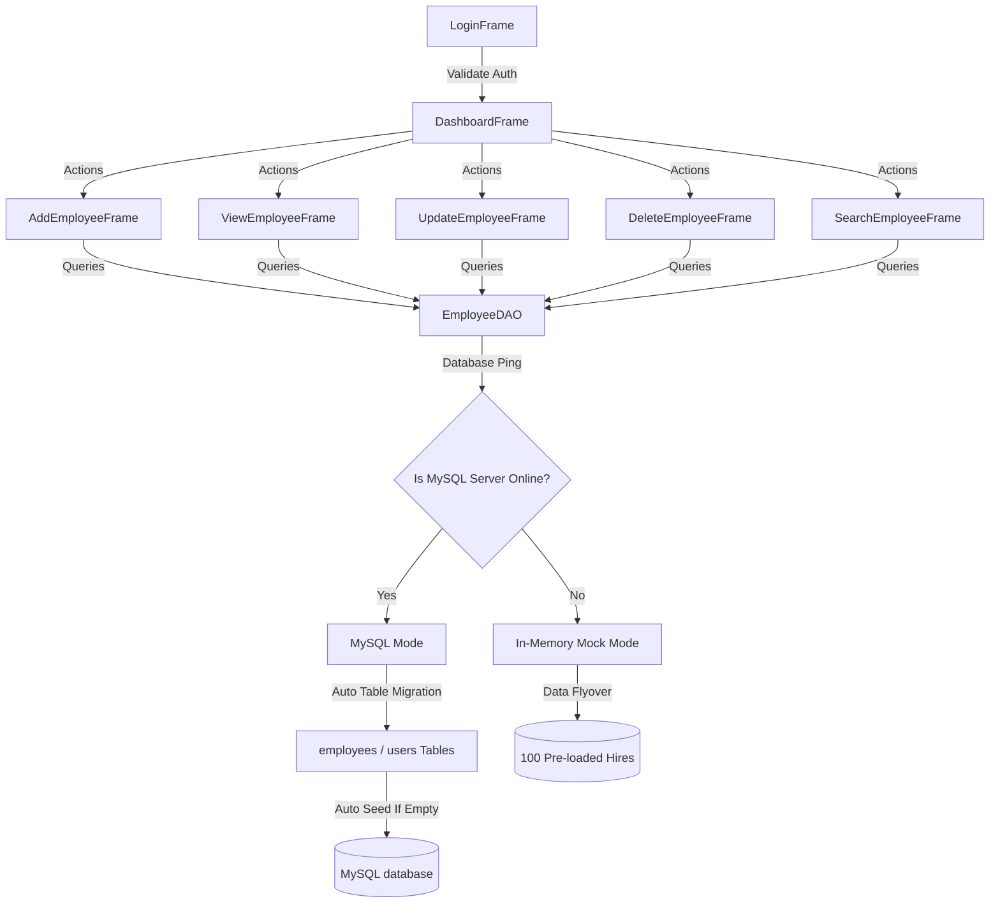
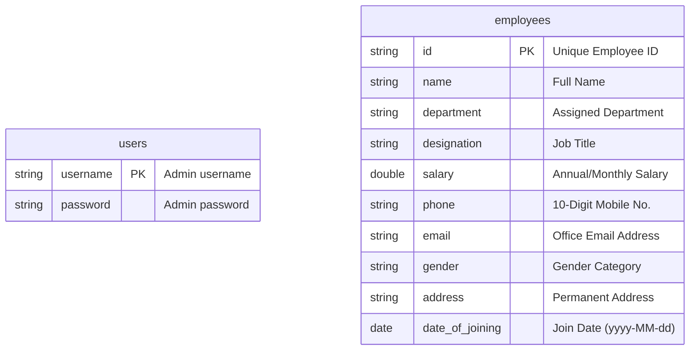

# Employee Management System (EMS)

A premium, modern desktop HR Management Software built using **Java Swing**, **JDBC**, and **MySQL**. Featuring a high-end dark blue and white theme, live dashboard analytics, responsive lists, and a standalone database fallback mode.

---

## 🚀 Key Features

*   **Premium Visuals & Theme**:
    *   **Primary color**: Sleek Dark Blue (`#1E3A5F`) and light backgrounds (`#F4F6F9`).
    *   **Flat UI Elements**: Hover effects, hand cursors, and custom border highlights to override default OS themes.
    *   **Table Enhancements**: Centered headers, alternating row colors, auto-resizing, and double-click row triggers.
*   **Dual Connection Modes (Zero-Configuration)**:
    *   **MySQL Mode**: Connects directly to a local MySQL instance using secure `PreparedStatement` boundaries.
    *   **In-Memory preview mode (Standalone)**: If MySQL is offline, the app automatically boots into standalone preview mode. **Anyone can run it immediately without setting up a database.**
*   **On-the-Fly Database Initialization**:
    *   Creates tables (`users` and `employees`) and registers default admin credentials automatically if they do not exist.
*   **On-the-Fly Data Population ("Data Flyover")**:
    *   Automatically detects empty databases and pre-loads **100 realistic sample records** (with varied departments, designations, joining dates, and contact information) so the app has dummy data immediately.
*   **Advanced Features**:
    *   Live header clock (real-time ticking date and time).
    *   Print directory lists directly from Java Swing.
    *   Export table directory to `.csv` spreadsheets.
    *   Multi-criteria search options (ID, Name, Phone, Department).
    *   Unicode UTF-8 support for special symbols (e.g. `₹` and `©`).

---

## 📐 System Architecture

### Application Flow & Database Hybrid Fallback


### Entity-Relationship Diagram (ERD)


---

## 📁 Package Structure

The project strictly isolates GUI layouts from core database connectivity:

```text
com.employee
├── dao
│   └── EmployeeDAO.java          # Handles MySQL Queries & Mock fallbacks
├── db
│   └── DBConnection.java         # Singleton Connection Provider
├── gui
│   ├── LoginFrame.java           # Authentication screen
│   ├── DashboardFrame.java       # Statistics Cards, Recent Hires list
│   ├── AddEmployeeFrame.java     # Form view with validations
│   ├── ViewEmployeeFrame.java    # Directory sheet, Export CSV, Print
│   ├── UpdateEmployeeFrame.java  # Edit profile updates
│   ├── DeleteEmployeeFrame.java  # Confirmation delete prompts
│   └── SearchEmployeeFrame.java  # Filter panels
├── model
│   └── Employee.java             # Employee POJO representation
└── util
    ├── Constants.java            # Color codes & font definitions
    ├── DateUtil.java             # Parser and formatter for Dates
    ├── DialogUtil.java           # Standard alert dialog popups
    ├── UIUtil.java               # Focus borders and hover managers
    └── ValidationUtil.java       # Fields validations (Phone, Email, Salary)
```

---

## 🔧 Setup & Configuration

### Prerequisites
*   **Java Runtime (JRE/JDK)**: Java 17 or higher.
*   **MySQL Server** (Optional): Version 8.x/9.x.

### Database Settings
Database configuration parameters are loaded dynamically from **[db.properties](file:///c:/Users/anupa/OneDrive/Desktop/EMS/db.properties)**:
```properties
db.url=jdbc:mysql://localhost:3306/employee_db?useSSL=false&allowPublicKeyRetrieval=true
db.username=root
db.password=your_mysql_password
db.driver=com.mysql.cj.jdbc.Driver
```

---

## ⚡ Execution

### 1. Run Standalone (Command Line)
1. Double-click the **[run.bat](file:///c:/Users/anupa/OneDrive/Desktop/EMS/run.bat)** file inside the root folder of the project.
2. If MySQL is offline, the program automatically boots into Standalone Preview Mode with 100 sample employees preloaded.
3. If MySQL is online, it will automatically connect, setup tables, and load the 100 sample employees into your database.

### 2. Run inside Eclipse IDE
1. Open Eclipse and import the project.
2. Right-click the project folder -> **Properties** -> **Java Build Path** -> **Libraries**.
3. Under Classpath, click **Add External JARs...** and choose the **[mysql-connector-j-9.0.0.jar](file:///c:/Users/anupa/OneDrive/Desktop/EMS/mysql-connector-j-9.0.0.jar)** downloaded at the project root.
4. Open **[LoginFrame.java](file:///c:/Users/anupa/OneDrive/Desktop/EMS/src/com/employee/gui/LoginFrame.java)**, right-click, and select **Run As -> Java Application**.

---

## 🔑 Administrative Credentials
To log in to the Dashboard:
*   **Username**: `admin`
*   **Password**: `admin`
